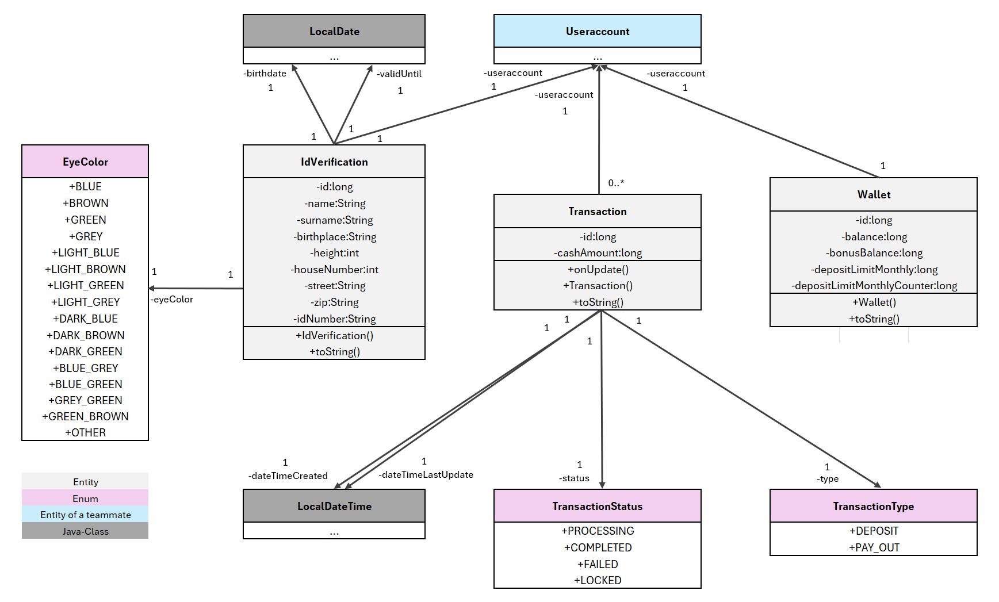

## 1. Project Status
This is a school project. The current implementation includes Entities, Repositories, Services, REST APIs and a `GlobalExceptionHandler`. 
My specific sub-project also covers the development of a transaction history and a user scoreboard. The integration of an AI for ID verification is planned for May.

## 2. Overview
This is a Spring Boot backend system for managing transactions, wallets, and ID verifications. The system provides a platform for financial transactions with integrated identity verification.

## 3. Key Features
* **Wallet Management:** Creation and management of user wallets.
* **Transaction Processing:** Deposits and withdrawals with status tracking (`PROCESSING`, `COMPLETED`, `FAILED`, `LOCKED`).
* **ID Verification:** Complete identity verification by uploading a picture.
* **Security Limits:** Monthly deposit limits with automatic monitoring.
* **REST-API:** Complete API endpoints for all core functionalities.
* **GlobalExceptionHandler:** Exceptions are caught and handled centrally.

## 4. Data Model

* **IdVerification:** This entity stores all relevant identification data of the user. The eye color (`eyeColor`) is strictly defined via the `EyeColor` enum. The ID data is permanently linked to exactly one user account.
* **Transaction:** This entity permanently stores all user deposits and withdrawals. The payment status and transaction type are defined by the `TransactionStatus` and `TransactionType` enums. Since a user account can make multiple payments, transactions are linked to the user account via a ManyToOne relationship.
* **Wallet:** This entity manages the user's current balance (`balance`) as well as the monthly deposit limit (`depositLimitMonthly`). A user account always possesses exactly one wallet.

**Additional Information:** Transactions are stored in Euros, whereas the wallet uses a virtual currency. During deposits and withdrawals, the amount is converted between Euros and the virtual currency. The conversion factor (`curr_to_points_factor`) is stored in the project's config folder and can be flexibly adjusted there if needed. The calculation is handled by the `currToPoints()` and `pointsToCurr()` methods, which convert and return the respective amounts.

## 5. API

### Wallet API (`/api/wallet`)
* `GET /getById/{id}` - Get wallet by ID.
* `GET /getByUseraccountId/{id}` - Get wallet by user ID.
* `POST /create` - Create new wallet.
* `PATCH /updateWalletDepositLimitMonthly` - Update monthly deposit limit.

### Transaction API (`/api/transaction`)
* `GET /getById/{id}` - Get transaction by ID.
* `GET /getAllByUseraccountId/{id}` - Get all transactions for a user.
* `POST /create` - Create transaction.
* `POST /execute` - Execute transaction.

### ID Verification API (`/api/IdVerification`)
* `POST /create` - Create ID verification (no data output).

> Available at `http://localhost:8080/swagger-ui` for testing

## 6. Business Logic
* **Transaction Validation:** Age verification (18+), ID document validity checks.
* **Limit Monitoring:** Automatic monitoring of monthly deposit limits.
* **Balance Verification:** Prevents negative account balances.
* **Status Management:** Complete transaction lifecycle management.

## 7. Security
* No output of sensitive ID data via API.
* Validation of all input data.

> We will learn more about advanced security concepts late in the second semester. I will update the security mechanisms as soon as that happens.

## 8. Testing

> **The test class was generated by AI**

**Test Results:**
35 Tests successful
0 Failures
0 Errors
0 Skipped

**What was tested:**

**Wallet Service (8 Tests)**
* Create, retrieve, update wallet
* Balance updates with deposit/payout
* Bonus balance and limits
* Exception handling

**Transaction Service (7 Tests)**
* Create, execute transaction
* Status updates
* Exception handling for invalid amounts

**ID Verification Service (10 Tests)**
* Create, update ID verification
* Age verification (18+), validity check
* Query for valid/expired IDs

**Integration Scenarios (3 Tests)**
* User creation flow
* Transaction flow
* Cross-service tests

**Error Handling Tests (4 Tests)**
* `EntityNotFoundException`
* `StatusAlreadySetException`
* `FalseTypeException`

**Boundary Tests (3 Tests)**
* Transaction amounts (0, 1, negative)
* Age limits (exactly 18, under 18)
* Wallet balance (exactly 0)
